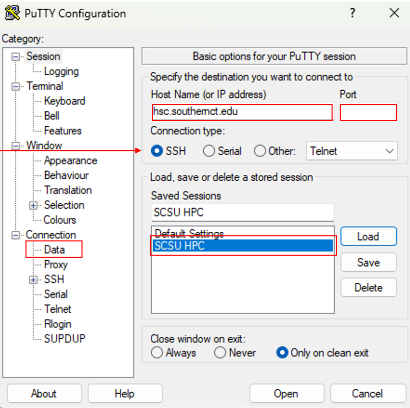
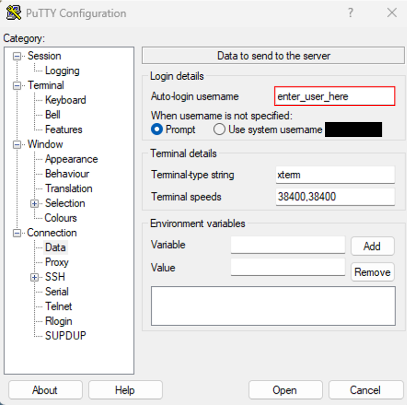

# Connecting

<span class="hpc-status hpc-status--verified">Observed / Verified</span>

Connect to the cluster using SSH. These instructions cover PuTTY on
Windows; any standard SSH client works the same way in principle.

## Prerequisites

- An active HPC account (see [Account Setup](accounts.md))
- Your HPC username
- [PuTTY](https://www.putty.org/) installed on Windows — see
  [Software → PuTTY](../software/putty.md) for installation steps, saved
  sessions in more depth, and setting up key-based login instead of a
  password

## Procedure

### 1. Configure the session

Open **PuTTY → Session** and enter:

| PuTTY field | Value |
|---|---|
| **Host Name (or IP address)** | `hsc.southernct.edu` |
| **Port** | `TODO: VERIFY WITH HPC ADMINISTRATOR` |
| **Connection type** | `SSH` |
| **Saved Sessions** | A descriptive name such as `SCSU HPC` |

!!! warning "SSH port"
    The SSH port is intentionally not published in this document. Obtain
    it from your HPC administrator through an approved channel.



### 2. Configure your username

Go to **Connection → Data** and enter your HPC username in
**Auto-login username**:

```text
<USERNAME>
```

!!! tip
    Don't rely on **Use system username** unless your local Windows
    username happens to match your HPC account name — explicitly setting
    it avoids PuTTY authenticating with the wrong account.



### 3. Save the session

Return to **Session**, confirm the name (e.g. `SCSU HPC`), and click
**Save**. This stores the hostname, port, and username on this
workstation — not your password.

### 4. Connect

1. Select the saved session and click **Load**, then **Open**.
2. On first connection, PuTTY shows a host-key prompt. Verify the server
   fingerprint through an approved source before accepting it.
3. Enter your HPC password when prompted.
4. If this is a new account, you'll be required to change your temporary
   password.

Next: [First Login](first-login.md) to confirm everything is working, or
[Software → WinSCP](../software/winscp.md) if you also need a graphical
way to move files.
