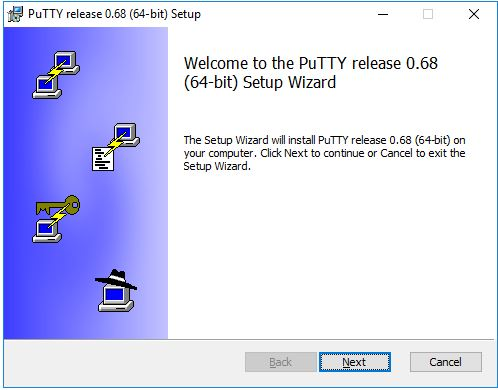
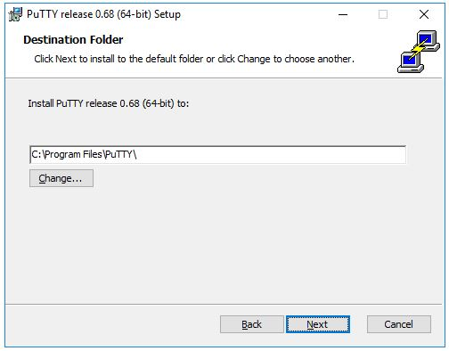
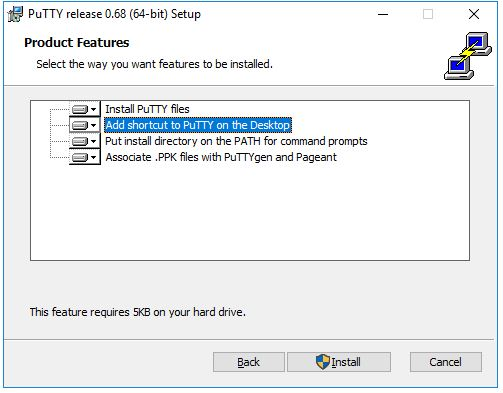
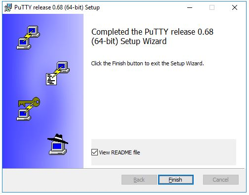
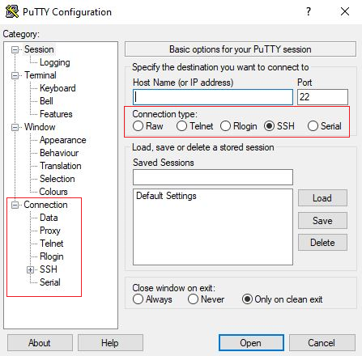
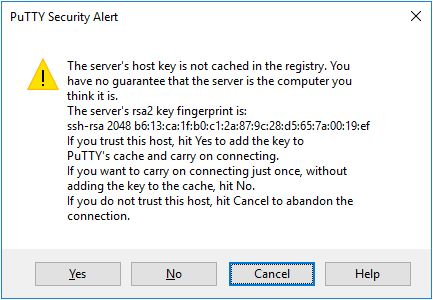

# PuTTY

<span class="hpc-status hpc-status--verified">Observed / Verified</span>

[PuTTY](https://www.putty.org/) is a free, open-source SSH terminal
client for Windows. It's the client this documentation's
[Connecting](../getting-started/connecting.md) procedure is written
against — this page covers installing it and a couple of features that
go beyond a basic login: saved sessions in more depth, public-key
authentication, and X11 forwarding.

## Installing PuTTY

1. Download the installer from the [official PuTTY download page](https://www.putty.org/).
   Choose the 64-bit `.msi` unless you know you need 32-bit.

    

2. Run the installer. It requires administrator rights on the machine
   you're installing to. Accept the default destination folder unless
   you have a reason to change it.

    

3. On the **Product Features** screen, add a desktop shortcut if you want
   one — everything else can be left at its default.

    

4. Click **Finish** to close the installer, then launch **PuTTY** from
   the Start menu or the desktop shortcut to confirm it opens.

    

!!! warning "Verification Required"
    Whether SSH access to this cluster requires being on the campus
    network or connected via VPN is `TODO: VERIFY WITH HPC
    ADMINISTRATOR` — confirm before assuming a direct connection will
    work from off-campus.

## Session configuration reference

See [Connecting](../getting-started/connecting.md) for the full
step-by-step login procedure. As a reference, the fields you'll set on
the **Session** screen:

| Field | Value | Notes |
|---|---|---|
| Host Name | `hsc.southernct.edu` | |
| Port | `TODO: VERIFY WITH HPC ADMINISTRATOR` | Not published in this document — obtain from your HPC administrator |
| Connection type | `SSH` | |
| Saved Sessions | e.g. `SCSU HPC` | Type a name, click **Save** to create a reusable profile |

Loading a saved session restores the hostname, port, and (if you set one
under **Connection → Data**) username — never your password.



See [Connecting](../getting-started/connecting.md#1-configure-the-session)
for a screenshot of this same screen filled in with this cluster's real
values.

### First-time host key prompt

The first time you connect to a given host, PuTTY can't yet verify it's
talking to the right server and shows a security alert:



Verify the fingerprint through an approved source before clicking **Yes**
— see step 4 of [Connecting](../getting-started/connecting.md#4-connect)
for this cluster's specific guidance. The fingerprint shown above is a
generic example, not this cluster's actual host key.

## Public-key authentication (optional)

Password login works out of the box (see
[Connecting](../getting-started/connecting.md)). If you'd rather
authenticate with an SSH key pair instead of typing your password every
time, use **PuTTYgen**, which ships with PuTTY.

### 1. Generate a key pair

1. Open **PuTTYgen**.
2. Leave the key type at its default (RSA, 4096 bits is a reasonable
   choice for most people).
3. Click **Generate** and move your mouse over the blank area until the
   progress bar fills — PuTTY uses the mouse movement as a source of
   randomness.
4. Set a passphrase for the private key (recommended for a key used
   interactively) and click **Save private key**.
5. Also save the public key, or leave the generated public-key text
   visible — you'll copy it in the next step.

### 2. Install the public key on the cluster

Log in to the cluster with your password (see
[Connecting](../getting-started/connecting.md)), then:

```bash
mkdir -p ~/.ssh
chmod 700 ~/.ssh
```

Open `~/.ssh/authorized_keys` in an editor and paste in the public key
text from PuTTYgen (a single line starting with `ssh-rsa` or similar):

```bash
vi ~/.ssh/authorized_keys
```

Then lock down the permissions — a shared-storage cluster like this one
will refuse to use a key file whose permissions are too open:

```bash
chmod 600 ~/.ssh/authorized_keys
```

### 3. Log in with the key

Back in PuTTY, load your saved session, then go to **Connection → SSH →
Auth → Credentials** and browse to your private key file (`.ppk`).
Return to **Session** and click **Open** — you should be prompted for
your key's passphrase (if you set one) instead of your account password.

!!! tip
    Save the updated session afterward so the key path is remembered for
    next time.

## X11 forwarding (optional)

X11 forwarding lets a graphical Linux application running on the cluster
display its window on your local machine, through an X server running on
Windows (e.g. VcXsrv or Xming — not included with PuTTY).

Enable it under **Connection → SSH → X11**, check **Enable X11
forwarding**, and connect as usual.

!!! warning "Verification Required"
    Whether X11 forwarding is enabled in this cluster's SSH server
    configuration is `TODO: VERIFY WITH HPC ADMINISTRATOR`.

## See also

- [Connecting](../getting-started/connecting.md) — the day-to-day login procedure
- [WinSCP](winscp.md) — graphical file transfer, can reuse the same saved PuTTY session
