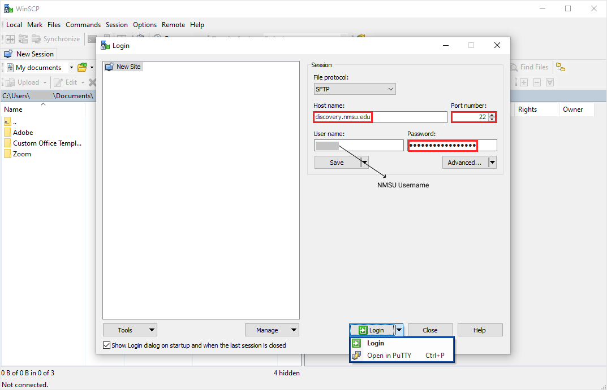
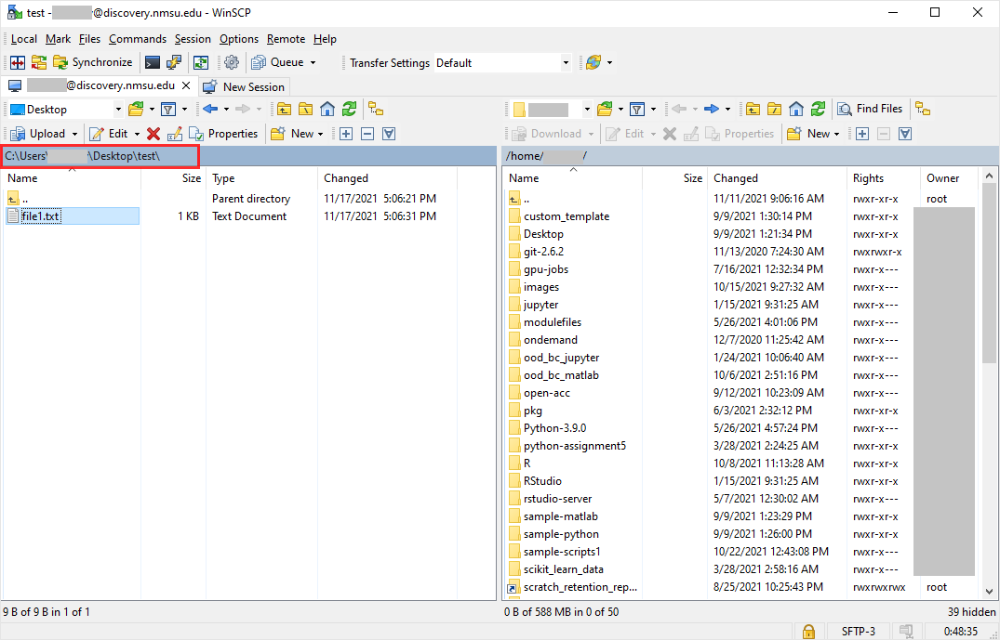
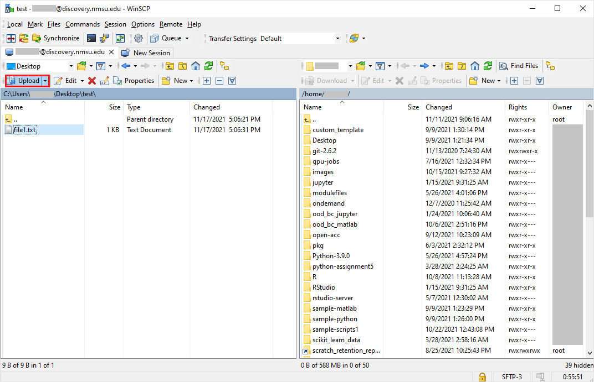
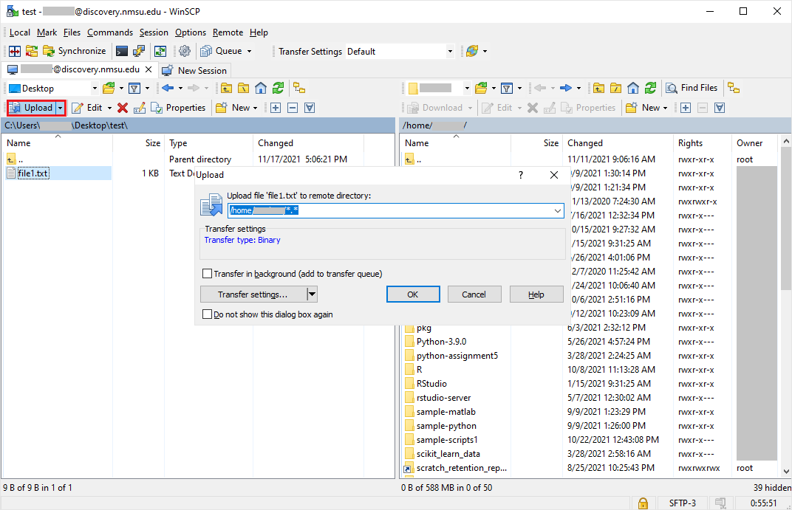
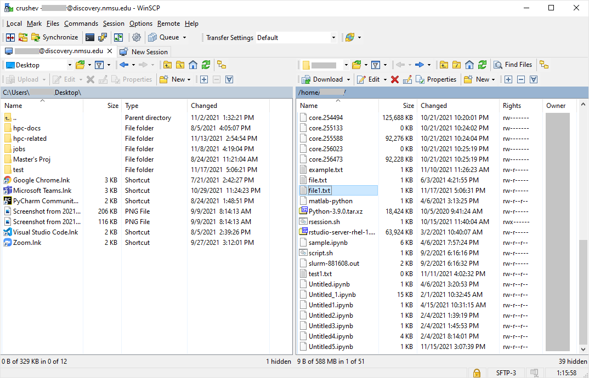
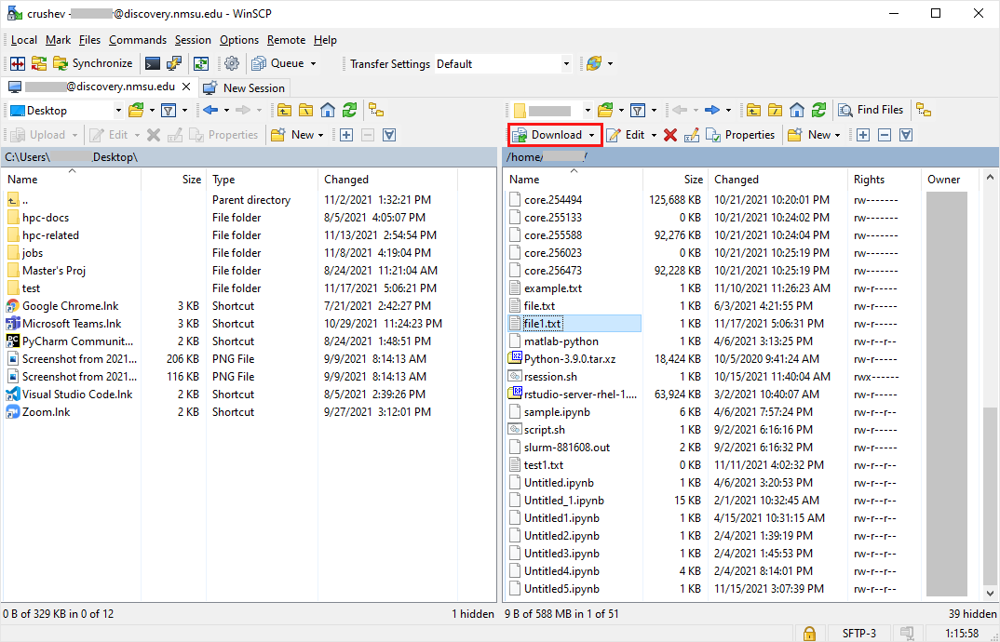
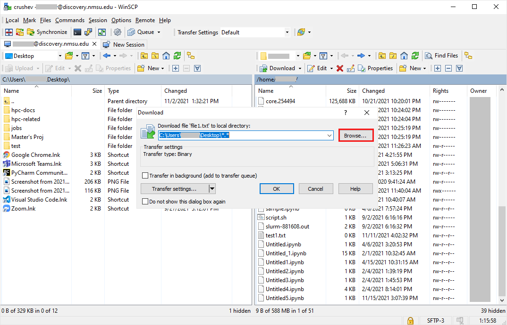

# WinSCP

Observed / Verified

[WinSCP](https://winscp.net/) is a free, open-source graphical SFTP/FTP
client for Windows. Where [Data Transfer](../storage/data-transfer.md)
covers command-line `scp`/`rsync`, this page covers the drag-and-drop GUI
alternative.

## Installing WinSCP

Download the installer from the [official WinSCP site](https://winscp.net/)
and run it, accepting the defaults.

!!! warning "Verification Required"
    Whether SSH access to this cluster requires being on the campus
    network or connected via VPN is `TODO: VERIFY WITH HPC
    ADMINISTRATOR` — confirm before assuming a direct connection will
    work from off-campus.

## Configuration

Open WinSCP and create a new site with:

| Field | Value |
|---|---|
| File protocol | `SFTP` |
| Host name | `hsc.southernct.edu` |
| Port number | `TODO: VERIFY WITH HPC ADMINISTRATOR` |
| User name | Your HPC username |
| Password | Your HPC password (or leave blank to be prompted) |

Click **Login**. On first connection you'll see a host-key verification
prompt — verify the fingerprint through an approved source before
accepting it, the same as with [PuTTY](putty.md#session-configuration-reference).

!!! tip "Reuse your PuTTY session"
    WinSCP's login dialog has an **Open in PuTTY** option (next to the
    Login button's dropdown) that launches a terminal to the same host
    using the session you just configured — handy when you want a
    terminal and a file browser side by side.

Once connected, WinSCP shows your local machine's files on one side and
your `/home/<USERNAME>` directory on the cluster on the other.

## Uploading files

1. In the local pane, navigate to and select the file or folder you want
   to upload.

    

2. Click **Upload** (or drag the file/folder across to the remote pane).

    

3. Confirm the destination path on the cluster — typically somewhere
   under your `/home/<USERNAME>` directory (see [Home Directory](../storage/home.md)) — and confirm.

    

!!! tip "Faster: drag and drop"
    Skip the Upload button entirely — drag the file or folder from the
    local pane (left) straight onto the destination folder in the remote
    pane (right).

## Downloading files

1. In the remote pane, navigate to and select the file or folder you
   want to bring back to your machine.

    

2. Click **Download** (or drag it across to the local pane).

    

3. Confirm the destination path on your local machine and confirm.

    

!!! tip
    Use the **Browse** button in the download dialog to pick the local
    destination folder instead of typing the path by hand.

!!! warning
    Don't use WinSCP to browse into `/scratch` expecting to see files
    from a specific compute node — `/scratch` is local to each node, not
    shared, so what you see depends on which node you're connected to
    (and you're not connected to a compute node this way at all — see
    [Scratch Storage](../storage/scratch.md)). Transfer to and from
    `/home`.

## See also

- [PuTTY](putty.md) — terminal access to the same host
- [Data Transfer](../storage/data-transfer.md) — the command-line equivalent (`scp`/`rsync`)
